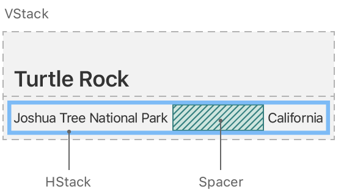
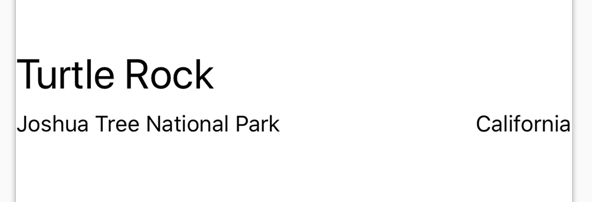
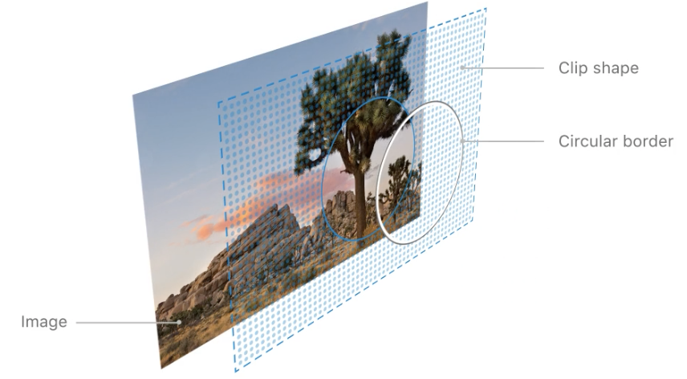
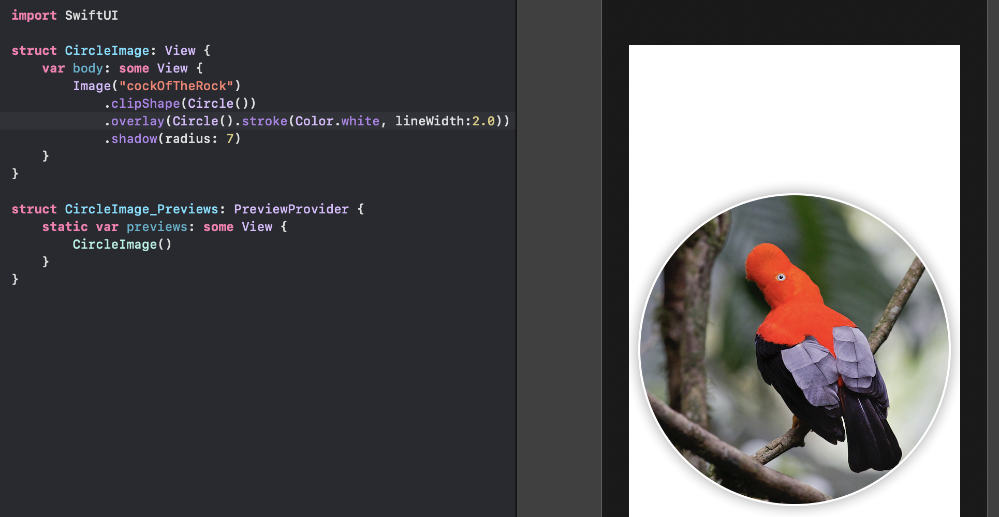
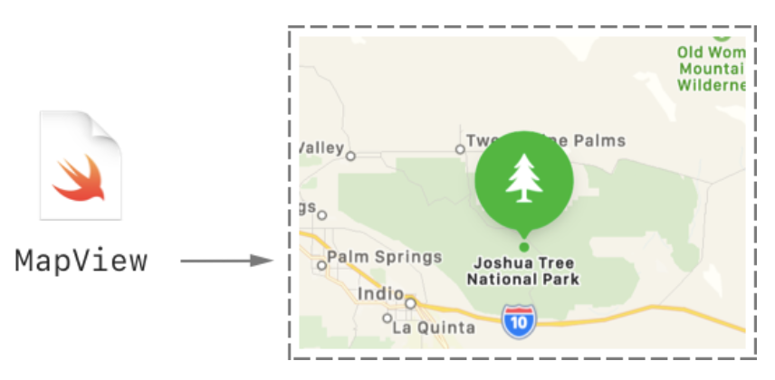
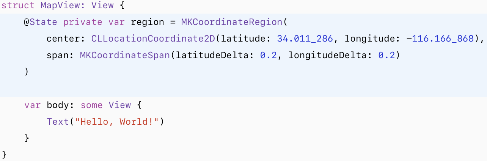
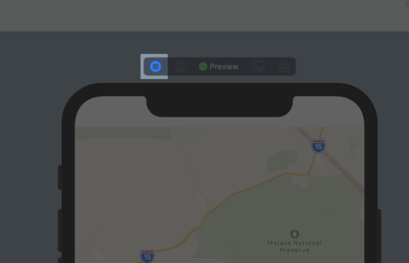
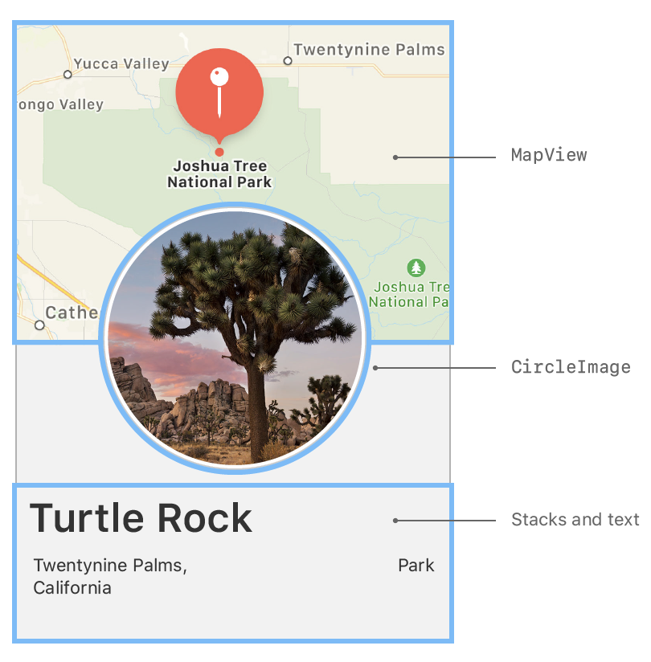

# Creating and combining Views

# New project - basic estructure

### **LandmarksApp.swift (main app file) - Application Class**

An app that uses the SwiftUI app life cycle has a structure that conforms to the App protocol. The structure’s body property returns one or more scenes, which in turn provide content for display. The @main attribute identifies the app’s entry point.

```swift
import SwiftUI

@main
struct LandmarksApp: App {
    var body: some Scene {
        WindowGroup {
            ContentView()
        }
    }
}
```

Structures, or structs, are one of the named types in Swift that allow you to encapsulate related properties and behaviors. You can define it, give it a name and then use it in your code. Similar to Data classes in Kotlin.

### ContentView.swift

By default, SwiftUI view files declare two structures. The first structure conforms to the View protocol and describes the view’s content and layout. The second structure declares a preview for that view (Helloooo, Jetpack Compose).

```swift
import SwiftUI

struct ContentView: View {
    var body: some View {
        Text("Hello, World!")
            .padding()
    }
}

struct ContentView_Previews: PreviewProvider {
    static var previews: some View {
        ContentView()
    }
}
```

The _ is used to define that the parameter is not named. For example, if a function is 
***func** **sum(_ a: Int, _ b: Int) : Int*** 
then we must call it as:
***let a = sum ( 1 , 2)***

But if it does not have _ we must call it as:
***let a = sum ( a: 1 , b: 2)***

Source: https://stackoverflow.com/questions/30876068/what-is-in-swift-telling-me

## Editing the UI

To customize a SwiftUI view, you call methods called **modifiers**. Modifiers wrap a view to change its display or other properties. Each modifier returns a new view, so it’s common to chain multiple modifiers, stacked vertically.

Your code is always the source of truth for the view. When you use the inspector to change or remove a modifier, Xcode updates your code immediately to match.

```swift
Text("Hello, world!")
    .font(.callout)
  .fontWeight(.heavy)
  .foregroundColor(Color.green)
  .multilineTextAlignment(.center)
  .padding()
```

You can also edit these modifiers by selecting the `Text` view and CMD + Click.

### Combine Views using Stacks

When creating a SwiftUI view, you describe its content, layout, and behavior in the view’s body property; however, the body property only returns a single view. You can combine and embed multiple views in stacks, which group views together horizontally, vertically, or back-to-front.



In XCode:
- To select all code: CMD + A
- To re-indent:  ^ + i    →  (Control + i) 
- To fold/unfold: ⌥ + CMD + ←    and     ⌥  + CMD + →
- Function definition: CMD + Click
- Tooltip of function definition: ⌥ + click

To direct the layout to use the full width of the device, separate the park and the state by adding a `Spacer` to the horizontal stack holding the two text views.

A *`spacer`* expands to make its containing view use all of the space of its parent view, instead of having its size defined only by its contents.

```swift
HStack {
    Text("Joshua Tree National Park")
            .font(.subheadline)
  Spacer()
  Text("California")
      .font(.subheadline)
}
```



### Create a Custom Image View

Instead of adding more code in this file, you’ll create a custom view that applies a mask, border, and drop shadow to the image.



Add an image to the `Assets.xcassets` and the reference it from the `CircleImage.swift` custom view.

Add a call to `clipShape(Circle())` to apply the circular clipping shape to the image.

The `Circle` type is a shape that you can use as a mask, or as a view by giving the circle a stroke or fill.



## Use SwiftUI Views From Other Frameworks

You can use the Map view from MapKit to render the map.



Create a private state variable that holds the region information for the map.

You use the `@State` attribute to establish a source of truth for data in your app that you can modify from more than one view. SwiftUI manages the underlying storage and automatically updates views that depend on the value (Helloooo, *mutablesStateOf*).



- `MKCoordinateRegion` is a rectangular geographic region centered around a specific latitude and longitude —> MapView in Google Maps for Android.
- `CLLocationCoordinate2D` is a structure that contains a geographical coordinate —> LatLng in Android.
- `MKCoordinateSpan` defines the width and height of a map region. You use the delta values in this structure to indicate the desired zoom level of the map, with smaller delta values corresponding to a higher zoom level.

Now add a `Map` view to the user interface.

By prefixing a state variable with `$`, you pass a binding, which is like a reference to the underlying value. When the user interacts with the map, the map updates the region value to match the part of the map that’s currently visible in the user interface. It means that make the `Map` view as a Composable (talking in Jetpack Compose words).

```swift
var body: some View {
        Map(coordinateRegion: $region)
}
```

**Note:** when previews are in static mode, they only fully render native SwiftUI views. For the Map view, you’ll need to switch to a live preview to see it render.



## Compose the Detail View

You now have all of the components you need — the name and place, a circular image, and a map for the location.

With the tools you’ve used so far, combine your custom views to create the final design for the landmark detail view.



Add a `VStack` and put all the current content of `ContentView.swift` into it.

Add your custom `MapView` to the top of the stack. Set the size of the `MapView` with `frame(width:height:)`.

When you specify only the `height` parameter, the view automatically sizes to the width of its content. In this case, `MapView` expands to fill the available space.

About moving files:
When you move the file, are you moving it with the Finder, or with the Xcode project navigator (the list of files on the left side of Xcode)?

**If you’re using the Finder**, you might notice that the file turns red in the Xcode project navigator after you move it. This is because Xcode projects have their own list of files in the project, and the Finder doesn’t know that it needs to update that list. 

You can either drag the file around in the Xcode project navigator to move it, or correct it afterwards by selecting the red file in the project navigator, then using the first tab of the inspector (the pane on the right side of Xcode) to set the new location.

**If you’re using the Xcode project navigator to move the file**, moving probably ought to just work. You might want to talk with someone in the Xcode Open Hours labs about what you’re seeing—it may be a bug. If the file doesn’t turn red after you move it, cleaning your project (Product > Clean Build Folder) might work around the problem.

**Note: I fix the "no recognized class" import by restarting XCode.**

- To layer the image view on top of the map view, give the image an offset of -130 points vertically, and padding of -130 points from the bottom of the view.
- These adjustments make room for the text by moving the image upwards.
- To allow the map content to extend to the top edge of the screen, add the ignoresSafeArea(edges: .top) modifier to the map view.
- Finally, move the subheadline font modifier from each `Text` view to the `HStack`containing them, and apply the secondary color to the subheadline text.
When you apply a modifier to a layout view like a stack, SwiftUI applies the modifier to all the elements contained in the group.

```swift
VStack {

        MapView()
            .ignoresSafeArea(edges: .top)
            .frame(height: 300)

    CircleImage()
          .offset(y: -130)
      .padding(.bottom, -130)

    VStack (alignment: .leading) {

       Text("Turtle Rock")
          .font(.title)

       HStack {
          Text("Joshua Tree National Park")
          Spacer()
          Text("California")
       }.font(.subheadline)
                .foregroundColor(.secondary)

        }.padding()

}
```
