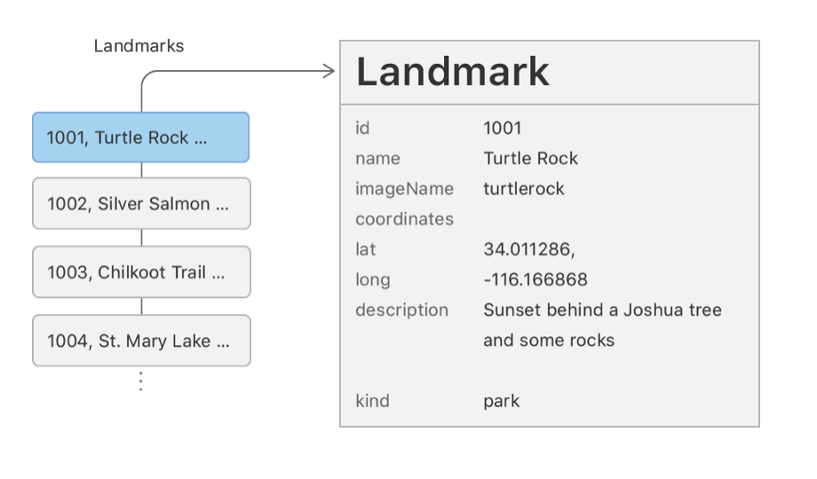
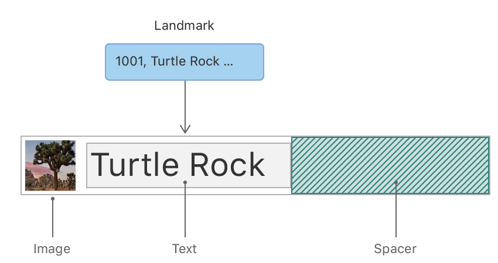
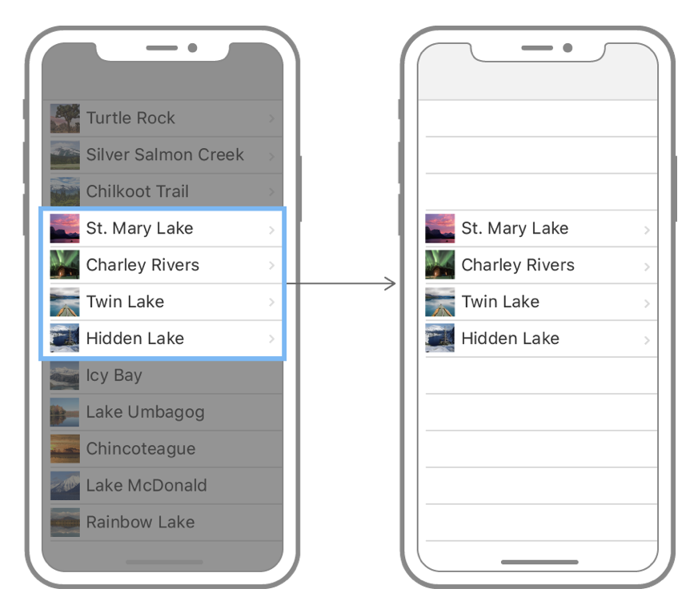
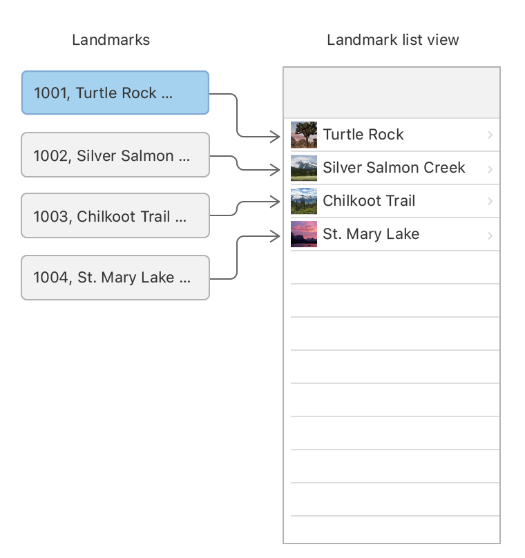
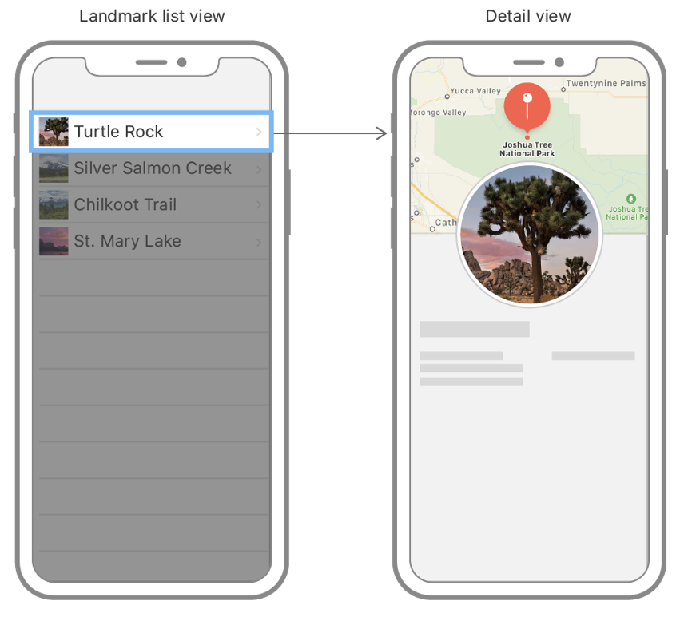

# Building Lists and Navigation

[https://developer.apple.com/tutorials/swiftui/building-lists-and-navigation](https://developer.apple.com/tutorials/swiftui/building-lists-and-navigation)

Create a Landmark model.

```swift
import Foundation

struct Landmark: Hashable, Codable {
    var id: Int
    var name: String
    var park: String
    var state: String
    var description: String
}
```



Adding Codable conformance makes it easier to load data into the structure from the data file, which you’ll do later in this section.

Add an `imageName` property to read the name of the image from the data, and a computed `image` property that loads an image from the asset catalog.

You make the property private because users of the `Landmarks` structure care only about the image itself.

```swift
import SwiftUI

struct Landmark {

	...

	private var imageName: String
	var image: Image {
		Image(imageName)
	}

}
```

Add a `coordinates` property to the structure using a nested `Coordinates` type that reflects the storage in the JSON data structure.

You mark this property as private because you’ll use it only to create a public computed property in the next step.

Compute a locationCoordinate property that’s useful for interacting with the MapKit framework.

```swift
struct Landmark {

	...

		private var coordinates: Coordinates
    var locationCordinates: CLLocationCoordinate2D {
        CLLocationCoordinate2D(latitude: coordinates.latitude, longitude: coordinates.longitude)
    }
    struct Coordinates: Hashable, Codable {
        var latitude: Double
        var longitude: Double
    }

}
```

### For Loading data from JSON file...

Create a `load(_:)` method that fetches JSON data with a given name from the app’s main bundle.

The load method relies on the return type’s conformance to the `Codable` protocol.

```swift
import Foundation

func load<T: Decodable>(_ filename: String) -> T {
    let data: Data

    guard let file = Bundle.main.url(forResource: filename, withExtension: nil)
    else {
        fatalError("Couldn't find \(filename) in main bundle.")
    }

    do {
        data = try Data(contentsOf: file)
    } catch {
        fatalError("Couldn't load \(filename) from main bundle:\n\(error)")
    }

    do {
        let decoder = JSONDecoder()
        return try decoder.decode(T.self, from: data)
    } catch {
        fatalError("Couldn't parse \(filename) as \(T.self):\n\(error)")
    }
}
```

***guard*** executes something if a condition **is false**.

Source: https://swiftbycoding.dev/swift/guard/

```swift
guard <boolean condition> else {

    <code body>
		// break
		// return
		// continue
		// throw

}
```

## Create the Row View



Add `landmark` as a stored property of `LandmarkRow`.

When you add the `landmark` property, the preview stops working, because the `LandmarkRow` type needs a landmark instance during initialization.

```swift
struct LandmarkRow: View {

    var landmark: Landmark

    var body: some View {
        Text("Hello, World!")
    }

}
```

In the `previews` static property of `LandmarkRow_Previews`, add the landmark parameter to the `LandmarkRow` initializer, specifying the first element of the `landmarks` array.

The preview still displays the text, “Hello, World!”.

```swift
struct LandmarkRow_Previews: PreviewProvider {
    static var previews: some View {
        LandmarkRow(landmark: landmarks[0])
    }
}
```

## Customize the Row Preview

Xcode’s canvas automatically recognizes and displays any type in the current editor that conforms to the `PreviewProvider` protocol. A preview provider returns one or more views, with options to configure the size and device.

You can customize the returned content from a preview provider to render exactly the previews that are most helpful to you.



You can use a `Group` to return multiple previews from a preview provider.

Wrap the returned row in a `Group`, and add the first row back again.

`Group` is a container for grouping view content. Xcode renders the group’s child views as separate previews in the canvas.

```swift
struct LandmarkRow_Previews: PreviewProvider {
    static var previews: some View {
        Group {
            LandmarkRow(landmark: landmarks[0])
                .previewLayout(.fixed(width: 300, height: 70))
            LandmarkRow(landmark: landmarks[1])
                .previewLayout(.fixed(width: 300, height: 70))
        }
    }
}
```

### Landmarks List

Create a `LandmarksList.swift` SwiftUI file.

Replace the default `Text` view with a `List`, and provide `LandmarkRow` instances with the first two landmarks as the list’s children.

The preview shows the two landmarks rendered in a list style that’s appropriate for iOS.

```swift
struct LandmarkList: View {
    var body: some View {
        List {
            LandmarkRow(landmark: landmarks[0])
            LandmarkRow(landmark: landmarks[1])
        }
    }
}
```

But, we should...

## Make the List Dynamic

Instead of specifying a list’s elements individually, you can generate rows directly from a collection.

You can create a list that displays the elements of collection by passing your collection of data and a closure that provides a view for each element in the collection. The list transforms each element in the collection into a child view by using the supplied closure.



**Lists work with identifiable data**. You can make your data identifiable in one of two ways: 
- by passing along with your data a key path to a property that uniquely identifies each element,
- by making your data type conform to the Identifiable protocol.

Complete the dynamically-generated list by returning a `LandmarkRow` from the closure.

This creates one `LandmarkRow` for each element in the `landmarks` array.

```swift
struct LandmarkList: View {
    var body: some View {
        List(landmarks, id: \.id) { landmark in
            LandmarkRow(landmark: landmark)
        }
    }
}
```

Next, you’ll simplify the `List` code by adding `Identifiable` conformance to the `Landmark` type.

Switch to `Landmark.swift` and declare conformance to the `Identifiable` protocol.

The `Landmark` data already has the `id`property required by `Identifiable`protocol; you only need to add a property to decode it when reading the data.

```swift
struct Landmark: Hashable, Codable, Identifiable {
    var id: Int
		...
}
```

## Set Up Navigation Between List and Detail

The list renders properly, but you can’t tap an individual landmark to see that landmark’s detail page yet.

You add navigation capabilities to a list by embedding it in a `NavigationView`, and then nesting each row in a `NavigationLink` to set up a transtition to a destination view.



Embed the dynamically generated list of landmarks in a NavigationView.

Call the `navigationTitle(_:)` modifier method to set the title of the navigation bar when displaying the list.

Inside the list’s closure, wrap the returned row in a `NavigationLink`, specifying the `LandmarkDetail` view as the destination.

```swift
var body: some View {
        NavigationView {

            List(landmarks) { landmark in
                NavigationLink(destination: LandmarkDetail()) {
                    LandmarkRow(landmark: landmark)
                }
            }
            .navigationTitle("Landmarks")

        }
}
```

## Pass Data into Child Views

The `LandmarkDetail` view still uses hard-coded details to show its landmark. Just like `LandmarkRow`, the `LandmarkDetail` type and the views it comprises need to use a `landmark` property as the source for their data.

Starting with the child views, you’ll convert `CircleImage`, `MapView`, and then `LandmarkDetail` to display data that’s passed in, rather than hard-coding each row.


In `CircleImage.swift`, add a stored `image`property to `CircleImage`.

This is a common pattern when building views using SwiftUI. Your custom views will often wrap and encapsulate a series of modifiers for a particular view.

```swift
struct CircleImage: View {
    var image: Image

    var body: some View {
        image
            .clipShape(Circle())
		...
}
```

In `MapView.swift` add a method that updates the region based on a coordinate value.

```swift
private func setRegion(_ coordinate: CLLocationCoordinate2D) {
        region = MKCoordinateRegion(
            center: coordinate,
            span: MKCoordinateSpan(latitudeDelta: 0.2, longitudeDelta: 0.2)
        )
}
```

And add an `onAppear` view modifier to the map that triggers a calculation of the region based on the current coordinate.

```swift
struct MapView: View {
    var coordinate: CLLocationCoordinate2D
    @State private var region = MKCoordinateRegion()

    var body: some View {
        Map(coordinateRegion: $region)
            .onAppear {
                setRegion(coordinate)
            }
    }

    private func setRegion(_ coordinate: CLLocationCoordinate2D) {
        region = MKCoordinateRegion(
            center: coordinate,
            span: MKCoordinateSpan(latitudeDelta: 0.2, longitudeDelta: 0.2)
        )
    }
}
```

For Landmark Detail, change the container from a `VStack` to a `ScrollView` so the user can scroll through the descriptive content, and delete the Spacer, which you no longer need.

Finally, call the `navigationTitle(_:)`modifier to give the navigation bar a title when showing the detail view, and the `navigationBarTitleDisplayMode(_:)` modifier to make the title appear inline.

The navigation changes only have an effect when the view is part of a navigation stack.

```swift
ScrollView {
            MapView(coordinate: landmark.locationCoordinate)
                .ignoresSafeArea(edges: .top)
                .frame(height: 300)

            CircleImage(image: landmark.image)
                .offset(y: -130)
                .padding(.bottom, -130)

            VStack(alignment: .leading) {
                Text(landmark.name)
                    .font(.title)
                    .foregroundColor(.primary)

                HStack {
                    Text(landmark.park)
                    Spacer()
                    Text(landmark.state)
                }
                .font(.subheadline)
                .foregroundColor(.secondary)

                Divider()

                Text("About \(landmark.name)")
                    .font(.title2)
                Text(landmark.description)
            }
            .padding()
}
.navigationTitle(landmark.name)
.navigationBarTitleDisplayMode(.inline)
```

## Preview in diferent devices

Within the list preview, embed the `LandmarkList` in a `ForEach` instance, using an array of device names as the data.

`ForEach` operates on collections the same way as the list, which means you can use it anywhere you can use a child view, such as in stacks, lists, groups, and more. When the elements of your data are simple value types — like the strings you’re using here — you can use `\.self` as key path to the identifier.

```swift
struct LandmarkList_Previews: PreviewProvider {
    static var previews: some View {
        ForEach(["iPhone SE (2nd generation)", "iPhone XS Max"], id: \.self) { deviceName in
            LandmarkList()
                .previewDevice(PreviewDevice(rawValue: deviceName))
        }
    }
}
```