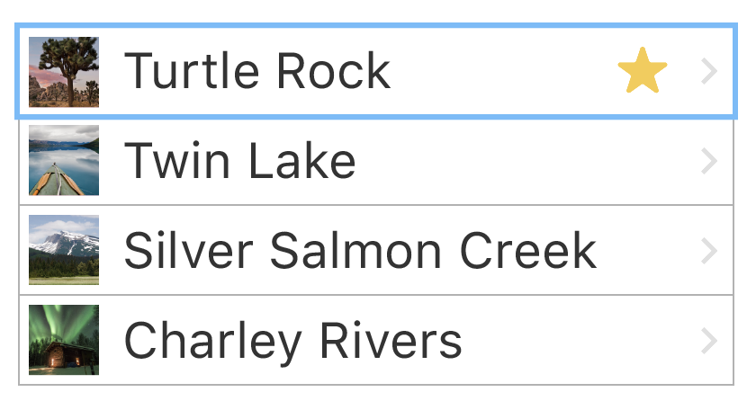
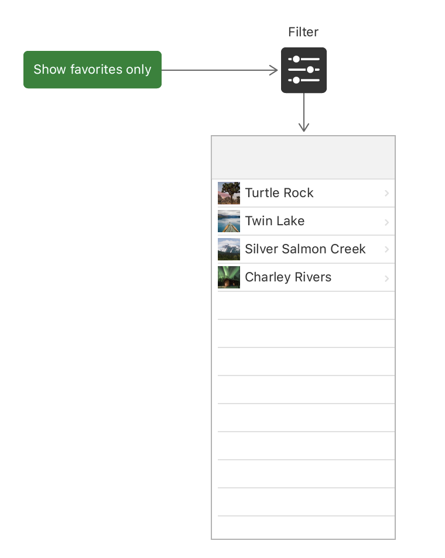
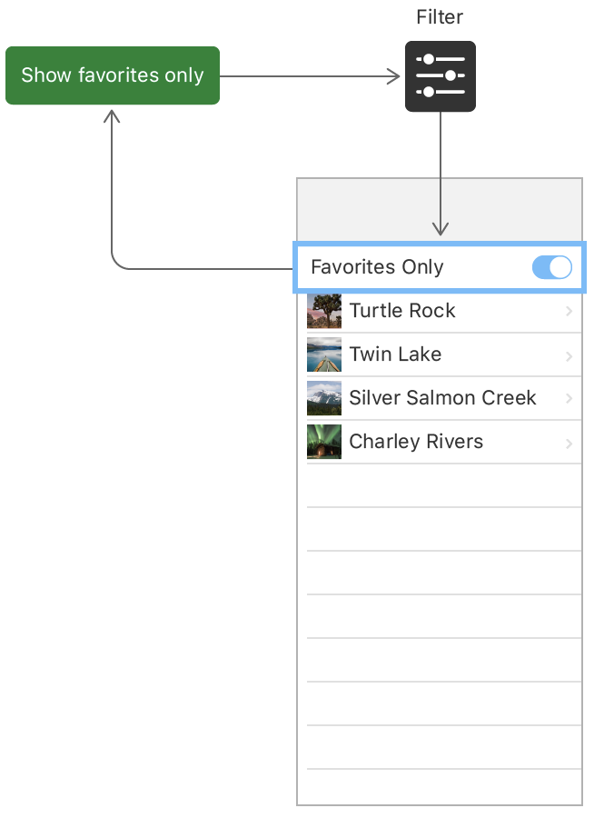
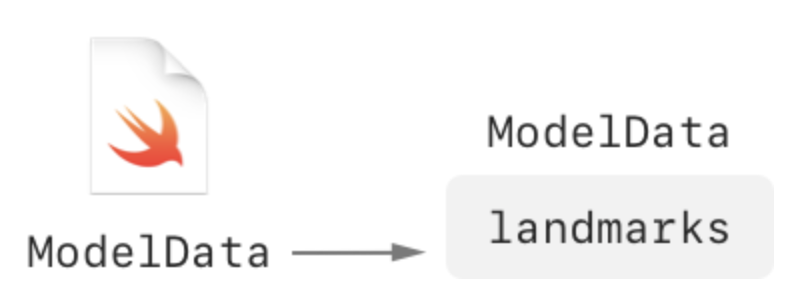
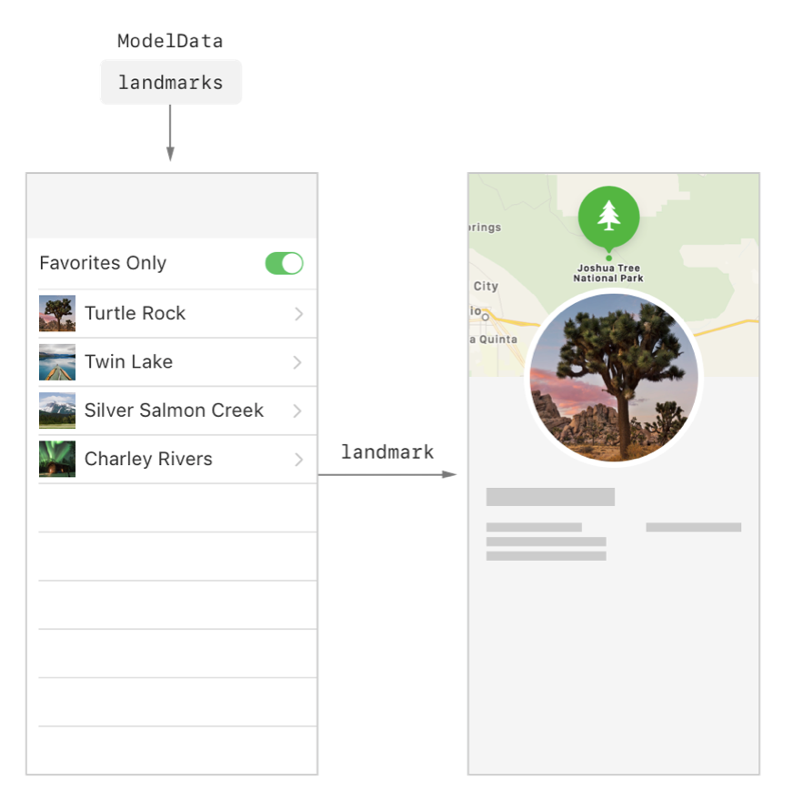
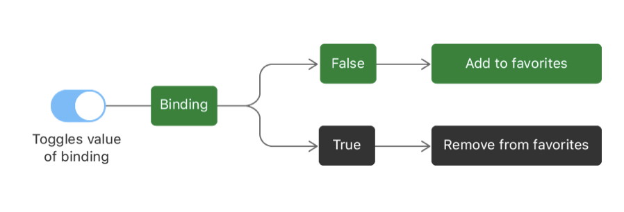

# Handling user input

[https://developer.apple.com/tutorials/swiftui/handling-user-input](https://developer.apple.com/tutorials/swiftui/handling-user-input)

In the Landmarks app, a user can flag their favorite places, and filter the list to show just their favorites. To create this feature, you’ll start by adding a switch to the list so users can focus on just their favorites, and then you’ll add a star-shaped button that a user taps to flag a landmark as a favorite.

## Mark the User’s Favorite Landmarks

Add a property to the Landmark structure to read the initial state of a landmark as a favorite, and then add a star to each LandmarkRow that shows a favorite landmark.



Add an `isFavorite` property to the `Landmark` structure.

The `landmarkData.json` file has a key with this name for each landmark. Because `Landmark` conforms to `Codable`, you can read the value associated with the key by creating a new property with the same name as the key.

In `LandmarkRow.swift` , after the spacer, add a star image inside an `if`statement to test whether the current landmark is a favorite.

In SwiftUI blocks, you use `if` statements to conditionally include views.

Because system images are vector based, you can change their color with the `foregroundColor(_:)` modifier.

The star is present whenever a landmark’s `isFavorite` property is `true`. You’ll see how to modify that property later in this tutorial.

```swift
if landmark.isFavorite {
        Image(systemName: "star.fill")
            .foregroundColor(.yellow)
}
```

"star.fill" is an Apple SF Symbol. You can find more here: https://developer.apple.com/design/human-interface-guidelines/sf-symbols/overview/
or by downloading the SF Symbols app: https://developer.apple.com/design/downloads/SF-Symbols.dmg

## Filter the list view

You can customize the list view so that it shows all of the landmarks, or just the user’s favorites. To do this, you’ll need to add a bit of *state* to the `LandmarkList` type.

*State* is a value, or a set of values, that can change over time, and that affects a view’s behavior, content, or layout. You use a property with the `@State` attribute to add state to a view.

Similar to `mutableStateOf` in Android Jetpack Compose.



In `LandmarksList.swift`, add a `@State` property called `showFavoritesOnly` with its initial value set to `false`.

Because you use state properties to hold information that is specific to a view and its subviews, you always create state as `private`. Then refresh the canvas.

```swift
@State private var showFavoritesOnly = false
```

When you make changes to your view’s structure, like adding or modifying a property, you need to manually refresh the canvas.

Then add a variable to filters the list. This variable is going to be used for showing the UI list.

```swift
var filteredLandmarks: [Landmark] {
        landmarks.filter { landmark in
                (!showFavoritesOnly || landmark.isFavorite)
        }
}
```

## Add a Control to Toggle the State

To give the user control over the list’s filter, you need to add a control that can alter the value of `showFavoritesOnly`. You do this by passing a binding to a toggle control.

A *binding* acts as a reference to a mutable state. When a user taps the toggle from off to on, and off again, the control uses the binding to update the view’s state accordingly.



Create a nested `ForEach` group to transform the landmarks into rows.

To combine static and dynamic views in a list, or to combine two or more different groups of dynamic views, use the `ForEach` type instead of passing your collection of data to `List`.

```swift
var body: some View {
        NavigationView {
            List {
                ForEach(filteredLandmarks) { landmark in
                    NavigationLink(destination: LandmarkDetail(landmark: landmark)) {
                        LandmarkRow(landmark: landmark)
                    }
                }
            }
            .navigationTitle("Landmarks")
        }
    }
```

`ForEach` is a structure that computes views on demand from an underlying collection of identified data.

A `List` has a special appearance, depending on the platform. For example, on iOS a list will appear as a table view and insert separator lines between its vertically stacked views.

You can use `ForEach` views inside `List` views to have both dynamic and static content – a very powerful feature of SwiftUI.

More info: https://stackoverflow.com/questions/56535326/what-is-the-difference-between-list-and-foreach-in-swiftui

Add a `Toggle` view as the first child of the `List` view, passing a binding to `showFavoritesOnly`.

You use the `$` prefix to access a binding to a state variable, or one of its properties.

```swift
List {

        Toggle(isOn: $showFavoritesOnly) {
                Text("Favorites only")
        }

        ForEach(filteredLandmarks) { landmark in
                NavigationLink(destination: LandmarkDetail(landmark: landmark)) {
                        LandmarkRow(landmark: landmark)
                }
        }

}
```

## Use an Observable Object for Storage

To prepare for the user to control which particular landmarks are favorites, you’ll first store the landmark data in an *observable object.*



An observable object is a custom object for your data that can be bound to a view from storage in SwiftUI’s environment. SwiftUI watches for any changes to observable objects that could affect a view, and displays the correct version of the view after a change.

Declare a new model type that conforms to the `ObservableObject` protocol from the Combine framework.

SwiftUI subscribes to your observable object, and updates any views that need refreshing when the data changes.

An observable object needs to **publish** any changes to its data, so that its **subscribers** can pick up the change.

```swift
import Combine

final class ModelData: ObservableObject {
        @Published var landmarks: [Landmark] = load("landmarkData.json")
}
```

## Adopt the Model Object in Your Views



In `LandmarkList.swift`, add an `@EnvironmentObject` property declaration to the view, and an `environmentObject(_:)` modifier to the preview.

The `modelData` property gets its value automatically, as long as the `environmentObject(_:)` modifier has been applied to a parent.

```swift
struct LandmarkList: View {
    
        @EnvironmentObject var modelData: ModelData

        ...
}

struct LandmarkList_Previews: PreviewProvider {
    static var previews: some View {
        LandmarkList()
            .environmentObject(ModelData())
    }
}
```

`EnvironmentObjec` is a property wrapper type for an observable object supplied by a parent or ancestor view.

An environment object invalidates the current view whenever the observable object changes. If you declare a property as an environment object, be sure to set a corresponding model object on an ancestor view by calling its `View.environmentObject(_:)` modifier.

`View.environmentObject(_:)` supplies an `ObservableObject` to a view subhierachy.

Update all the views to use `ModelData` object to provide the data of the landmarks.

Update the `ContentView` preview to add the model object to the environment, **which makes the object available to any subview**.

A preview fails if any subview requires a model object in the environment, but the view you are previewing doesn’t have the `environmentObject(_:)` modifier.

```swift
struct ContentView_Previews: PreviewProvider {
    static var previews: some View {
        ContentView()
            // ContentView, which has LandmarksList view, requires a Model
            // data as a EnvironmentObject
            .environmentObject(ModelData())
    }
}
```

Next, you’ll update the app instance to put the model object in the environment when you run the app in the simulator or on a device.

Same in Application class.

Update the `LandmarksApp` to create a model instance and supply it to `ContentView` using the `environmentObject(_:)` modifier.

Use the `@StatObject` attribute to initialize a model object for a given property only once during the life time of the app. This is true when you use the attribute in an app instance, as shown here, as well as when you use it in a view.

```swift
@main
struct LandmarksApp: App {
    
    @StateObject private var modelData = ModelData()
    
    var body: some Scene {
        WindowGroup {
            ContentView()
                .environmentObject(modelData)
        }
    }

}
```

`@StatObject` is a property wrapper type that instantiates an observable object.

## Create a Favorite Button for Each Landmark

The Landmarks app can now switch between a filtered and unfiltered view of the landmarks, but the list of favorite landmarks is still hard coded. To allow the user to add and remove favorites, you need to add a favorite button to the landmark detail view.



Create a `FavoriteButton.swift` SwiftUI file.

Add an `isSet` binding that indicates the button’s current state, and provide a constant value for the preview.

Because you use a binding, changes made inside this view propagate back to the data source.

```swift
import SwiftUI

struct FavoriteButton: View {
    @Binding var isSet: Bool

    var body: some View {
        Text("Hello, World!")
    }
}

struct FavoriteButton_Previews: PreviewProvider {
    static var previews: some View {
        FavoriteButton(isSet: .constant(true))
    }
}
```

`@Binding` A property wrapper type that can read and write a value owned by a source of truth.

Use a binding to create a two-way connection between a property that stores data, and a view that displays and changes the data. A binding connects a property to a source of truth stored elsewhere, instead of storing data directly.

For example, a button that toggles between play and pause can create a binding to a property of its parent view using the `Binding` property wrapper.

That means, that a parent view instantiate a single view and pass a `@State` value, and this child view can update this value by *binding* to a local variable marked with `@Binding`.

Next, you’ll add the FavoriteButton to the detail view, binding the button’s isSet property to the isFavorite property of a given landmark.

Switch to `LandmarkDetail.swift`, and compute the index of the input landmark by comparing it with the model data.

To support this, you also need access to the environment’s model data.

```swift
struct LandmarkDetail: View {

        @EnvironmentObject var modelData: ModelData
    var landmark: Landmark

    var landmarkIndex: Int {
        modelData.landmarks.firstIndex(where: { $0.id == landmark.id })!
    }

        ...

}
```

Embed the landmark’s name in an `HStack`with a new `FavoriteButton`; provide a binding to the `isFavorite` property with the dollar sign (`$`).

Use `landmarkIndex` with the `modelData`object to ensure that the button updates the `isFavorite` property of the landmark stored in your model object. 

This will allow to update the state of the object (`isFavorite` value in this case) in the whole application since the source of truth is the `EnvironmentObject` `modelData`.

```swift
HStack {

        Text(currentLandmark.name)
                .font(.title)
                .foregroundColor(.primary)

        FavoriteButton(isSet: $modelData.landmarks[landmarkIndex].isFavorite)

}
```